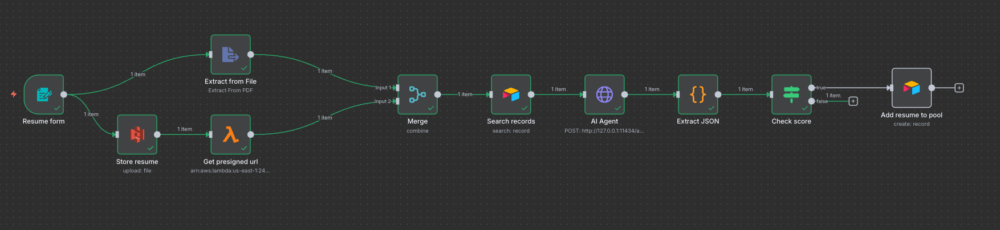

# n8n AWS Lambda S3 Ollama Airtable Resume Agent

## Overview
This project is an **AI-powered Resume Screening Agent** built using **n8n**, **AWS Lambda**, **S3**, **Ollama**, and **Airtable**.  
It automates the resume screening process by comparing uploaded resumes against job descriptions and ranking candidates based on their match score.

The system combines **AI reasoning**, and **workflow orchestration** — allowing recruiters to automatically extract data, evaluate candidates, and organize results in Airtable.



---

## Watch Project Overview

[](https://www.youtube.com/watch?v=t4__XU8CN8c)

---

## Features
- Upload resumes through an **n8n form trigger**
- Generate secure, time-limited **AWS S3 presigned URLs** using **AWS Lambda**
- Parse PDF resumes via **n8n Extract From File**
- Use **Ollama (Llama 3 model)** to analyze resumes and produce structured JSON results
- Automatically store ranked results in **Airtable**
- Link each resume to the corresponding job description dynamically
- Extract and clean JSON safely from AI responses using Python

---

## Architecture
```text
[n8n Form Trigger]
        ↓
[Store Resume → AWS S3 Upload]
        ↓
[AWS Lambda → Generate Presigned URL]
        ↓
[Extract Text from Resume (PDF)]
        ↓
[Fetch Matching Job Description from Airtable]
        ↓
[Ollama AI Agent → JSON Evaluation]
        ↓
[Python Code → Extract JSON]
        ↓
[IF Node → Filter by Match Score ≥ 80]
        ↓
[Store Results in Airtable]
```

---

## AWS Lambda Setup

### Lambda Function: `s3-presign`
This Lambda function dynamically generates presigned URLs for S3 file uploads and downloads.  
It ensures that uploaded resumes are securely handled and automatically expire after a defined period.

```python
import os
import json
import boto3

s3 = boto3.client('s3', region_name=os.environ['REGION'])

def lambda_handler(event, context):
    headers = {
        "Content-Type": "application/json",
        "Access-Control-Allow-Origin": "*",
    }

    key = event.get("key")
    method = (event.get("method") or "GET").upper()
    content_type = event.get("contentType")
    expires_in = int(os.environ.get("EXPIRY_SECONDS", "3600"))
    bucket = os.environ["BUCKET"]

    if not key:
        return {
            "statusCode": 400,
            "headers": headers,
            "body": {"error": "Missing key"}
        }

    try:
        params = {"Bucket": bucket, "Key": key}
        if method == "PUT" and content_type:
            params["ContentType"] = content_type

        op = "put_object" if method == "PUT" else "get_object"
        url = s3.generate_presigned_url(
            ClientMethod=op,
            Params=params,
            ExpiresIn=expires_in
        )

        return {
            "statusCode": 200,
            "headers": headers,
            "body": {
                "presigned_url": url,
                "method": method,
                "bucket": bucket,
                "key": key,
                "expires_in": expires_in
            }
        }

    except Exception as e:
        return {
            "statusCode": 500,
            "headers": headers,
            "body": {"error": str(e)}
        }
```

### Environment Variables
| Key | Description |
|-----|--------------|
| REGION | Your AWS region (e.g., `us-east-1`) |
| BUCKET | The name of your S3 bucket |
| EXPIRY_SECONDS | Presigned URL expiry time (default: 3600s) |

---

## n8n Workflow Breakdown

### **Resume Form (Trigger)**
Creates a form for candidates to upload resumes and select a job title.  
```json
"fieldLabel": "Resume",
"fieldType": "file",
"acceptFileTypes": ".pdf"
```

### **Store Resume (AWS S3)**
Uploads the file from n8n to your S3 bucket.

### **AWS Lambda (Get Presigned URL)**
Calls the Lambda function to generate a presigned link:
```json
{ "key": "{{ $('Resume form').item.json.Resume.filename }}", "method": "GET" }
```

### **Extract from File**
Parses the resume PDF into text for AI analysis.

### **Ollama AI Agent**
Sends resume text, job description, and required skills to the local **Ollama API** (using the `llama3` model) to evaluate fit and return structured JSON.

### **Extract JSON (Python Node)**
Cleans and extracts valid JSON from the AI’s raw text response:

```python
import json
import re

item = items[0]
response_text = item["json"].get("response", "").strip()

match = re.search(r'```(?:json)?\s*({[\s\S]*?})\s*```', response_text)

if match:
    cleaned_json = match.group(1)

else:
    match_brace = re.search(r'({[\s\S]*})', response_text)
    cleaned_json = match_brace.group(1) if match_brace else "{}"

try:
    parsed = json.loads(cleaned_json)

except json.JSONDecodeError:
    parsed = json.loads(json.loads(f'"{cleaned_json}"'))

except Exception as e:
    parsed = {
        "error": f"Failed to parse Ollama response: {str(e)}",
        "raw_response": response_text,
        "cleaned_json_attempt": cleaned_json
    }

return [{"json": parsed}]
```

### **Airtable (Create Record)**
Creates a record with candidate details, match score, and attached resume file link in the “Resumes” table.

### **Filter High Matches**
Adds logic to only approve or forward resumes with match score ≥ 80.

---

## Airtable Schema

**Table 1: Job Descriptions**  
| Field | Type | Description |
|--------|------|-------------|
| Job Title | Text | Job position title |
| Job Description | Long Text | Role responsibilities |
| Required Skills | Long Text | List of skills |
| Position Filled | Checkbox | Mark if job is closed |

**Table 2: Resumes**  
| Field | Type | Description |
|--------|------|-------------|
| Name | Text | Candidate name |
| Email | Text | Candidate email |
| Phone | Text | Candidate phone |
| Match Score | Number | AI-generated score |
| Recommended Position | Text | Suggested role |
| Fit Summary | Options (Strong, Moderate, Poor) | Overall evaluation |
| Attachments | File | Resume upload (S3 link) |
| Linked Job Description | Link | Reference to job description |

---

## Future Enhancements
- Integration with Slack or Teams for HR notifications  
- Add RAG-based (Retrieval-Augmented Generation) context search for better AI evaluation  
- Use OpenAI or Claude for hybrid LLM testing  

---

### Security Disclaimer
This repository does not include any sensitive credentials, access keys, or production configurations.
All connection details (AWS, Telegram, Ollama, etc.) are placeholders for demonstration purposes only.

When setting up this workflow in your own environment, make sure to:
• Store all credentials securely inside n8n’s Credentials Manager
• Never hardcode access keys, tokens, or secrets directly in workflow nodes or code
• Use test accounts or sandbox environments when experimenting

Kodelle Inc. and Jawwad Ahmed Abbasi assume no responsibility for security misconfigurations in user deployments.

---

### License
Proprietary License - All Rights Reserved
© 2025 Jawwad Ahmed Abbasi, Kodelle Inc.

This project is protected under a proprietary license.
You may view and learn from the source code for educational or portfolio purposes,
but commercial use, modification, or redistribution requires a paid license or written permission.

For licensing or commercial use inquiries: jawwad@kodelle.com

---

## Author
**Jawwad Ahmed Abbasi**  
Senior Software Developer  
[GitHub](https://github.com/jawwadabbasi) | [YouTube](https://www.youtube.com/@jawwad_abbasi)